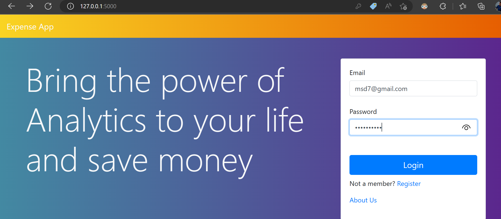
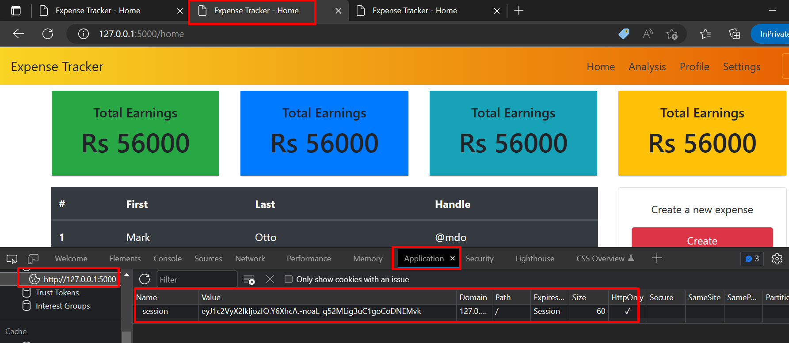
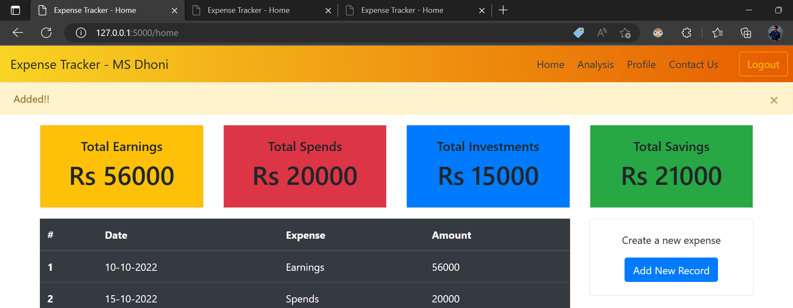
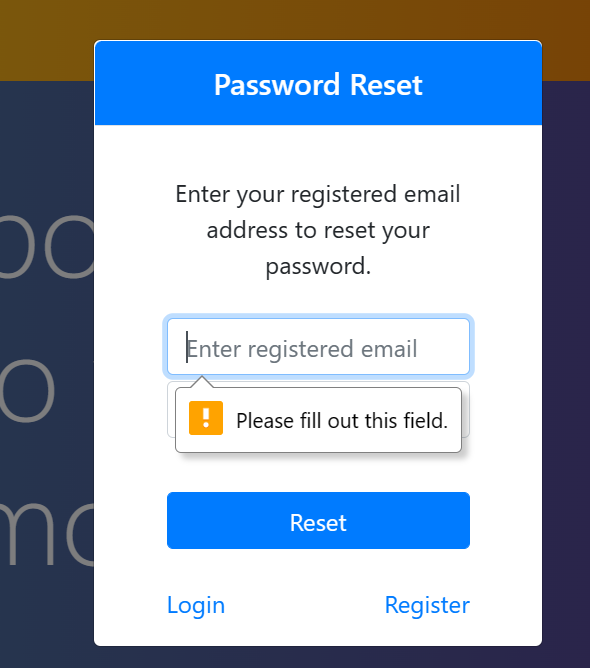
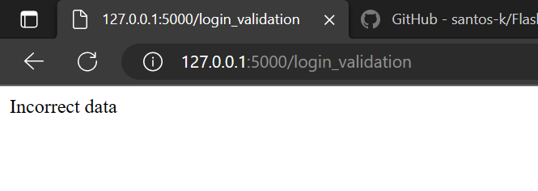

# Flask_Expense_App
Creating a simple Expense Track app using Flask and Python

1. Create New Repository in GitHub as `Flask_Expense_App`
2. Clone this repo in local env `git repo https://github.com/santos-k/Flask_Expense_App.git`
3. Open VS Code or Pycharm
    1. Open the Project
       1. File and Directory structure
          1. `main.py`
          2. templates
             1. index.html
             2. register.html
             3. about.html
             4. home.html
          3. static 
             1. css
                1. style.css
4. Register Functionality 
   1. Register Functionality
        * Front end: Take the userdata from the form on clicking Register button then send to '/registration' using 'post' method
            ```
          <form class="form" method="post" action="/registration">
                <label>Name</label><br>
                <input type="text" class="form-control" name="name" placeholder="Enter your full name"><br>
                <label>Email</label><br>
                <input type="email" class="form-control" name="email" placeholder="Enter your email"><br>
                <label>Password</label><br>
                <input type="password" class="form-control" name="password" placeholder="Enter your password"><br><br>
                <input type="submit" class="btn btn-primary btn-block btn-lg" value="Register">
              </form>
          ```
          * Backend: will receive the data from frontend at '/registration' then insert into database over the condition otherwise keep on same page
            ```
            @app.route('/registration',methods=['POST'])
            def registration():
            name = request.form.get('name')
            email = request.form.get('email')
            passwd = request.form.get('password')
            if len(name)>5 and len(email)>10 and len(passwd)>5:
                cursor.execute("""INSERT INTO expense_details VALUES(NULL,'{}','{}','{}')""".format(name,email,passwd))
                myconn.commit()
                return  f"Successfully Registered!!"
            else:
                return render_template("register.html")
            ```

 # Problem
   - Here we have a problem with url, our '/login_validation' and '/registration' route must be hidden because this routes handling functionality
   - Problem in login   
   - Registration problem with correct data  
   - with incorrect data 

   # Solution
   1. instead of returning as `return render_template('home.html')` or return render_template("register.html") will use redirect function
      1. Login 
         ```
            from flask import redirect
            if len(users) > 0:
                return redirect('/home')
            else:
                return redirect('/')
         ``` 
         
   
      2. Register
         ```
         if len(name)>5 and len(email)>10 and len(passwd)>5:
             cursor.execute("""INSERT INTO expense_details VALUES(NULL,'{}','{}','{}')""".format(name,email,passwd))
             myconn.commit()
             return redirect('/')
         else:
             return redirect('/register')
         ```
        

        
                
       
          
          
          
                    
            
## Git Push Commands
1. `git init` to initialize repo
2. `git add .` adding files 
3. `git commit -m "Add existing project files to Git"` stagging 
4. `git remote add origin https://github.com/cameronmcnz/example-website.git` (optionl assiging repo )
5. `git status` to check stagging/added files status
6. `git push -u -f origin master` final push to git
