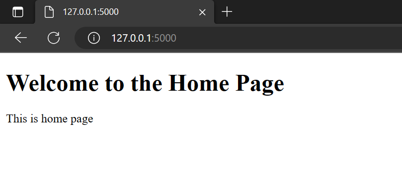
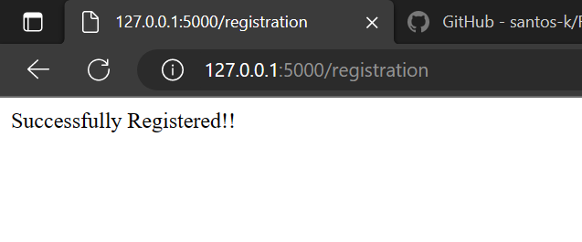

# Flask_Expense_App
Creating a simple Expense Track app using Flask and Python

1. Create New Repository in Github as `Flask_Expense_App`
2. Clone this repo in local env `git repo https://github.com/santos-k/Flask_Expense_App.git`
3. Open VS Code or Pycharm
    1. Open the Project 
    2. **Testing Simple Flask app**: Create a new `main.py` file
        1. test simple flask code with simple html code
            ```
            from flask import Flask
            app = Flask(__name__)
            @app.route('/')
            def home():
                return "<h1 style='color:red'>Hello World</h1>"

            @app.route('/about')
            def about():
                return "This is about page"

            if __name__ == "__main__":
                app.run(debug=True)
            ```
        2. Save and run this script, open VS terminal and run `python main.py`, open default url if not present in terminal http://127.0.0.1:5000/, generally default port 5000 assign to Flask.

        3. Output in browser at this home url http://127.0.0.1:5000/ or http://127.0.0.1:5000 will be `Hello Falsk` in red color
        4. Output at `/about` for url http://127.0.0.1:5000/about will be `This is about page` 
    3. ** Testing Flask app with html file using render template **
       1. File and Folder structures
          1. Project File
             1. `main.py`
             2. templates
                1. index.html
                2. about.html
       2. Now, run `main.py`
       3. Result: 
          1. on homepage: http://127.0.0.1:5000/  
              
          2. on about page: http://127.0.0.1:5000/about  
          
          
                    
            
## Git Push Commands
1. `git init` to initialize repo
2. `git add .` adding files 
3. `git commit -m "Add existing project files to Git"` stagging 
4. `git remote add origin https://github.com/cameronmcnz/example-website.git` (optionl assiging repo )
5. `git status` to check stagging/added files status
6. `git push -u -f origin master` final push to git
